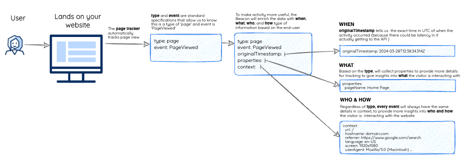

<h1 align="center">
Beacon
</h1>

<p align="center">
  
  
  
  
  
</p>

<p align="center">
Modern packaging to support the foundation for first-party web analytics
<p>

<p align="center">
  <a href="#overview">What is the Beacon?</a> •
  <a href="#play">Play with the Beacon</a> •
  <a href="#install">Install the Beacon</a> •
  <a href="#contribute">Contribute</a> 
</p>

<a id="overview"></a>

## What is "Beacon"?

In a nutshell, this library provides a modern foundation to create a custom and trusted first-party beacon to be placed on websites and then collect events from users. It has been created to illustrate the patterns of packaging and collecting critical data points that can be expanded by others as needed.



This repository creates a single minified javascript file called `beacon.js` which you can install into an experience to see what analytics are tracked. You can always find the latest file in the [`GitHub Releases`](https://github.com/Deloitte/beacon/releases) folder, as well as previously released versions.

<a id="play"></a>

## Play with the beacon

If you want to skip ahead and play with it for the simplest web page as an example. Go [here](https://deloitte.github.io/beacon/inline/most-simple.html) to see the `sandbox/inline/most-simple.html` example. Once on this page, you will see logs show up on your screen. You can click on each of the activities to see the detailed logs. As you load the page and interact with you, you will see all of the events that the beacon collects.


## Install the beacon

For those that would like to take the compiled beacon and apply it to your web experience to see how it collects data, you'll want to follow the steps below:

- **A.** To add the beacon to a website, you will need to use an **installation script**, which allows you to pass **configuration** and will load the `beacon.js` file.
- **B.** Once the beacon is installed, it will start based on your configuration and will collect users, sessions, page views, and events through use **trackers** and **tags**.
- **C.** As analytics are collected, they currently are logged out, but you could extend to send it to the transporting API of choice.

<a id="install"></a>

### Installation script

> For many examples on how to install the script, including a more complex installation snippet, check out the [detailed playground that shows the installation along with live logs to see how it all works](https://deloitte.github.io/beacon/index.html)

The simplest way to install the beacon is to use an **inline installation script**. This allows you to place a singular javascript file on your page and it'll take care of the rest.

```javascript
  <html>
    <head>
      // Place this script anywhere on your page (either in the head or before the end of the body)
      <script type="text/javascript" id="beaconScript" async src="YOURURL/beacon.js" data-api-root="YOURURL"></script>
    </head>
```

- You will need to replace `YOURURL` with wherever you are sending the data, you omit this when you are just playing with the beacon.
- This script helps simplify the installation you can further configure this installtion by adjusting `data-identity` or defining trackers with `data-trackers`.

<a id="contribute"></a>

## Contributing to the beacon

If you'd like to contribute, please read our guide to [contributing](./CONTRIBUTING.md)