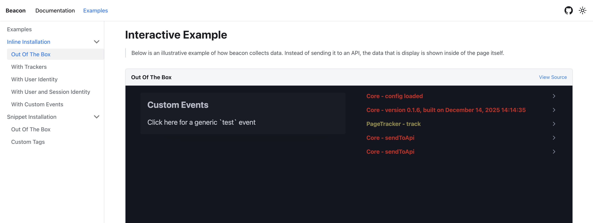

<h1 align="center">
Beacon
</h1>

<p align="center">
Modern packaging to support the foundation for first-party web analytics
<p>

<p align="center">
  <a href="#overview">What is Beacon?</a> •
  <a href="#play">Play with the Beacon</a> •
  <a href="https://deloitte.github.io/beacon/">Documentation</a> •
  <a href="#install">Install the Beacon</a> •
  <a href="#contribute">Contribute</a> 
</p>

<p align="center">
  <a href="https://github.com/Deloitte/beacon/releases"></a>
  
  <a href="https://www.bestpractices.dev/projects/11608" target="_blank"></a>
  <a href="https://github.com/Deloitte/beacon/blob/main/LICENSE" target="_blank"></a>
  <a href="https://github.com/Deloitte/beacon/actions/workflows/main-test.yml" target="_blank"></a>
</p>

<a id="overview"></a>

## What is Beacon?

> In modern web experiences the collection of behavioral analytics is expected, but consumer trust in how that data is collected and shared is at an all time low. 

We've created Beacon to provide a modern foundation to create a trusted foundation for collecting first-party web analytics using a privacy-first and configurable foundation. While there are many solutions in the market for this, it is important to provide education into the patterns of web tracking and create a foundation that allows for flexibility without heavy dependencies.


### What is in the codebase?
A stable framework of strongly typed code with highly testable components and minimal dependencies to provide a clear and stable developer experience and ability to extend as needed. 

### What is compiled?
The output of this library is a single minified javascript file called `beacon.js` which can be installed into any web experience and further configured to collect web analytics events. You get the latest file from [GitHub Pages](https://deloitte.github.io/beacon/beacon.js) or from the [GitHub Releases](https://github.com/Deloitte/beacon/releases) folder.

<a id="play"></a>

## Play with the beacon
> Note: This experience has `beacon.js` installed and as an end-user will see log events in your browser, but you will also see that the delivery of these events is not enabled. Therefore - no data is collected from this experience or transported in any way.

If you want to go straight to playing with the Beacon, [Click here to see an out of the box implementation](https://deloitte.github.io/beacon/docs/examples/inline/out-of-the-box). This page is an embedded iframe with a vanilla HTML page that has `beacon.js` installed as well as a simple log script to display the logs directly to you in the browser. You can click on elements on the page to see how the data is collected. As you load the page and interact with you, you will see all of the events that the beacon collects.



<a id="install"></a>

## Install the beacon

> For many examples on how to install the script, including a more complex installation snippet, check out the [detailed playground that shows the installation along with live logs to see how it all works](https://deloitte.github.io/beacon/docs/examples)

The simplest way to install the beacon is to use an **inline installation script**. This allows you to place a singular javascript file on your page and it'll take care of the rest.

```javascript
  <html>
    <head>
      // Place this script anywhere on your page (either in the head or before the end of the body)
      <script type="text/javascript" id="beaconScript" async src="YOURURL/beacon.js" data-api-root="YOURURL"></script>
    </head>
```

- You will need to replace `YOURURL` with wherever you are sending the data, you omit this when you are just playing with the beacon.
- This script helps simplify the installation you can further configure this installtion by adjusting `data-identity` or defining trackers with `data-trackers`.

<a id="contribute"></a>

## Contribute

If you'd like to contribute, please read our guide to [contributing](./CONTRIBUTING.md)